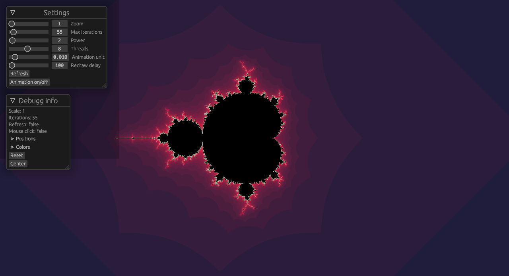

# fractals in rust

### contains:
- mandelbrot

### usage:
    tab                     - change color scheme
    mose click              - change center of the world
    rightclick              - almost a julia set
    wheele                  - zoom
    esc                     - settings
    space                   - toggle animation

